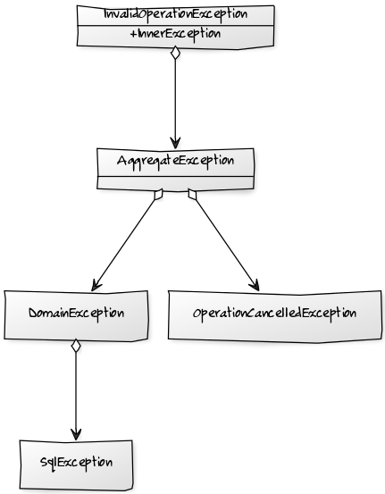

# Обработка исключений

В массовое сознание программистов *исключения* проникли через C++. Сейчас их можно встретить во всех языках-наследниках: Java, JavaScript, C#, PHP и так далее.
Языки функционального программирования можно использовать для удобной обработки исключений. Мы решим эту задачу на F# и C#, чтобы показать, что функциональный подход проще.

## Для чего нужны исключения

*Исключения* позволяют упросить код. Вложенность вызовов в программе может быть очень большой, и, если ошибка возникает где-то внизу, информацию о ней приходится в
явном виде передавать наверх через результаты функций. Как правило, на каждом уровне приходится писать код обработки. Вот как это выглядело когда-то на C:

```c
/*
** Программа для подсчёта количества вхождений строки в указанный файл.
** Вызов:
**   crep <строка> <имя_файла>
*/
#include <stdio.h>

int count_string(char* string, char* filename);

int main(int argc, char *argv[])
{
  int count;
  char *string;
  char *filename;

  if (argc != 3) {
    fputsf("Вызов: crep <строка> <имя_файла>", stderr);
    return -1;
  }

  string = argv[1];
  filename = argv[2];

  count = count_string(string, filename);

  if (count < 0) {
    perror("Can't open file");
    return -2;
  }

  printf("%d\n", count);

  return 0;
}

#define BUFFER_SIZE 1024

int count_string(char* string, char* filename)
{
  int count = 0;
  int eof = 0;
  char buffer[BUFFER_SIZE];
  FILE* input;

  if (NULL == string)
    return -1;

  if (NULL == filename)
    return -2;

  input = fopen(filename, "rt");

  if (input == NULL)
    return -3;

  while (NULL != fgets(buffer, BUFFER_SIZE, input)) {
    if (NULL != strstr(buffer, string))
      count++;
  }

  eof = feof(input);
  fclose(input);

  if (eof)
    return count;

  return -4;
}
```

Видим, что код получился большой и запутанный. Это потому, что у нас учебный пример. В реальной программе код будет ещё запутанней.

Как нам помогают *исключения*? Они позволяют не писать промежуточный код. Функции не должны больше ничего возвращать, если это не обусловлено их логикой.
Функции, которые возвращают результаты, не должны больше смешивать их в странных комбинациях с кодами ошибок.

Создать *исключения* не сложнее, чем вернуть значение. Мы видим, что плюсов много. Но есть и минусы.

Один из них заключается в том, что концепция *исключений* сложна для освоения. Недостаточно выучить ключевые слова или идиомы, необходимо усвоить набор принципов.
Если вы вставляете блок `try`/`catch` в каждом методе, вы неправильно применяете *исключения*.

## Внутренние исключения

Если в C++ вы можете бросить исключение любого типа, то в Java и C# тип исключения должен быть наследником класса `Exception`.
В обоих каркасах исключение может ссылаться на внутреннее исключение, то есть на свою причину. Такой подход
позволяет связывать исключения в цепочки.

```c#
public void CreateUser(string username, string email)
{
    using (var command = commandFactory.Create("INSERT INTO [Users] (username, email) VALUES (?, ?)", username, email))
    {
        CheckedExecuteNonQuery(command, "Ошибка при создании пользователя.");
    }
}

private void ChekedExecuteNonQuery(SqlCommand command, string message)
{
    try
    {
        command.ExecuteNonQuery();
    }
    catch (Exception exception)
    {
        throw new EntityException(message, exception, typeof(User));
    }
}
```


В C# существует класс `AggregateException`, с помощью которого можно собирать независимые исключения, например, возникшие в параллельных процессах. Таким образом исключения
могут образовывать не только цепочки, но и деревья.



Важный вопрос: зачем нам вообще цепочки исключений? [Википедия утверждает](https://en.wikipedia.org/wiki/Exception_chaining), что методы должны бросать исключения того же
уровня абстракции, на котором они находятся.

Звучит слишком абстрактно? Рассмотрим конкретный пример. Мы сохраняем в БД пользователя с существующим электронным адресом. В таблице пользователей создан уникальный индекс для поля `email`.
При выполнении команды `INSERT` возникнет исключение `SqlException` со свойством `Number` равным 2601. Для уровня предметной области эта информация слишком детальна.
Мы можем описать класс `EntityException` и создавать его в случае конфликта.

Код, который будет обрабатывать это исключение, должен будет знать только об уровне предметной области и об `EntityException`.
Если мы захотим изменить СУБД, или перейти на хранилище NoSQL, нам не придётся переписывать код высокого уровня, вырезая из него обработку `SqlException`.

С другой стороны, если возникла ошибка, нам нужна вся информация о её причинах, поэтому мы не должны просто так &laquo;терять&raquo; исключение низкого уровня.
Создавая экземпляр `EntityException`, мы сохраняем ислючение-причину в свойстве `InnerException`.

Реализуя лог ошибок, мы будем писать в него не только исключения высшего уровня, а всю цепочку целиком. Если ошибка возникнет,
мы получим всю доступную информацию.

## Обработка исключений

Есть важный принцип, который применяется при работе с исключениями: *throw early, catch later*. Бросать исключения как можно раньше, обрабатывать как можно позже.
Мы не будем подробно останавливаться на первой части принципа, а перейдём ко второй, поскольку это и есть тема нашего обсуждения.

Если вы не знаете, что делать с исключенем, не обрабатывайте его, положитесь на код, который знает&nbsp;&mdash; это и есть *catch later*. Кажется, что таких
обработчиков может быть много, но на практике речь идёт об одном или двух. Почему?

Рассмотрим ситуацию на примере REST-сервиса. Что делает REST-сервис в случае ошибки?
Он возвращает [код и текстовое описание в строке статуса](http://www.w3.org/Protocols/rfc2616/rfc2616-sec6.html):

    HTTP/1.1 409 Confict

Он может вернуть [JSON с детальным описанием](http://jsonapi.org/format/#errors):

```javascript
{
  errors: [
    {
      id: 'email',
      status: 409,
      title: 'Пользователь с таким электронным адресом уже зарегистрирован.',
      detail: 'Кажется, вы уже регистрировались у нас. Если вы забыли пароль, восстановите его.'
    }
  ]
}
```

Метод, обрабатывающий запрос REST и есть код, который знает, что делать с исключением.
Если &laquo;что-то пошло не так&raquo;, метод возращает код ошибки и подходящий объект JSON.

```c#
public class UserController : ApiController
{
    private readonly IUserRepository userRepository;
    private readonly DtoMapper dtoMapper;

    . . .

    public IHttpActionResult Get(int id)
    {
        try
        {
            var user = userRepository.ReadById(id);
            var userDto = dtoMapper.Map(user);
            return Content(HttpStatusCode.OK, userDto, new JsonMediaTypeFormatter()); 
        }
        catch (Exception exception)
        {
            var restError = GetRestError(exception);
            return Content(httpError.Status, httpError.Object, new JsonMediaTypeFormatter());
        }
    } 
}
```

Мы видим, что каждый метод сервиса надо оборачивать в конструкцию `try`/`catch`, при этом способ обработки исключений во всех методах один и тот же.
Такое решение нарушает принцип [DRY](https://ru.wikipedia.org/wiki/Don%E2%80%99t_repeat_yourself).

К счастью, в XXI веке все промышленные библиотеки позволяют внедрить глобальный обработчик, который обрабатывает все необработанные исключения.
Код REST-запросов становится чище.

```c#
public class UserController : ApiController
{
    private readonly IUserRepository userRepository;
    private readonly DtoMapper dtoMapper;

    . . .

    public UserDto Get(int id)
    {
        var user = userRepository.ReadById(id);

        return dtoMapper.Map(user);
    } 
}
```

В ASP.NET Web API 2 глобальный обработчик исключений [выглядит так](https://docs.microsoft.com/en-us/aspnet/web-api/overview/error-handling/web-api-global-error-handling):

```c#
class JsonApiError
{
    public string Id { get; set; }

    public HttpStatusCode? Status { get; set; }

    public string Title { get; set; }

    public string Detail { get; set; }
}

class JsonApiTopLevelError
{
    public IReadOnlyCollection<JsonApiError> Errors { get; set; }
}

class RestError
{
    public HttpStatusCode Status { get; set; }

    public JsonApiTopLevelError Object { get; set; }
}

class RestErrorResult : IHttpActionResult
{
    private readonly HttpRequestMessage requestMessage;
    private readonly RestError restError;

    public RestErrorResult(HttpRequestMessage requestMessage, RestError restError)
    {
        this.requestMessage = requestMessage;
        this.restError = restError;
    }

    public Task<HttpResponseMessage> ExecuteAsync(CancellationToken cancellationToken)
    {
        var response = new HttpResponseMessage(restError.Status);
        var json = JsonConverter.Serialize(restError.Object);
        response.Content = new StringContent(json);
        response.RequestMessage = requestMessage;

        return Task.FromResult(response);
    }
}

class RestExceptionHandler : ExceptionHandler
{
    private readonly IRestExceptionParser parser;

    public RustExceptionHandler(IRestExceptionParser parser)
    {
        this.parser = parser;
    }

    public override void HandleCore(ExceptionHandlerContext context)
    {
        var restError = parser.Parse(context.Exception);
        context.Result = new RestErrorResult(context.ExceptionContext.Request, restError);
    }
}
```

Этот код решает несколько задач, поэтому выглядит сложным. Мы не будем обсуждать детали, а сразу перейдём к главному методу.
`IRestExceptionParser.Parse` получает на вход исключение (за которым, как мы помним, прячется дерево исключений), анализирует его,
и возвращает статутс HTTP и объект, который мы сериализуем в JSON.

## Реализация обработки на C# #

Как обработка исключений выглядит на императивном объекто-ориентированном языке? Как мы определим, что пользователь с таким электронным
адресом уже есть в базе? На уровне предметной области у нас будет `EntityException`, откуда мы извлечём тип
объекта (`EntityException.EntityType == typeof(User)`). На инфраструктурном уровне мы получим внутреннее исключение `SqlException` с полем
`Number` равным 2601.

Эта пара исключений должна встретиться нам где-то в дереве исключений. Чтобы пройти по дереву, используем паттерн *Посетитель* (*Visitor*).
Создадим абстрактный *Акцептор* и метод расширения *Visit*:

```c#
abstract class Acceptor
{
    public abstract bool Accept(Exception exception);
}

static class ExceptionExtensions
{
    public static void Visit(this Exception exception, Acceptor acceptor)
    {
        if (acceptor.Accept(exception))
            return;

        var aggregateException = exception as AggregateException;
        if (aggregateException != null)
        {
            foreach (var innerException in aggregateException.InnerExceptions)
                innerException.Visit(acceptor);

            return;
        }

        if (exception.InnerException != null)
            exception.InnerException.Visit(acceptor);
    }
}
```

Здесь всё по учебнику. Если вы не понимаете, как работает этот код, обратитесь к описанию паттерна *Посетитель* в
[книге банды четырёх (GoF)](https://books.google.ru/books/about/%D0%9F%D1%80%D0%B8%D0%B5%D0%BC%D1%8B_%D0%BE%D0%B1%D1%8A%D0%B5%D0%BA%D1%82%D0%BD%D0%BE_%D0%BE%D1%80%D0%B8%D0%B5%D0%BD.html?id=HN2IkgAACAAJ&redir_esc=y).
Последнее, что нам осталось: реализовать конкретный *Акцептор*, который будет собирать информацию об ошибке.

```c#
class RestErrorAcceptor : Acceptor
{
    public HttpStatusCode Status { get; protected set; }

    public string Title { get; private set; }

    RestErrorElement()
    {
        Status = HttpStatusCode.InternalServerError;
        Title = "На сервере возникла внутренняя ошибка. Скоро всё поправим.";
    }

    public override bool Accept(Exception exception)
    {
        var entityException = exception as EntityException;
        if (entityException != null)
        {
            var sqlException = exception.InnerException as SqlException;
            if (sqlException != null)
            {
                if (sqlException.Number == 2601)
                {
                    Status = HttpStatusCode.Conflict;

                    if (entityException.EntityType == typeof(User))
                        Title = "Пользователь с таким электронным адресом уже существует.";
                    else if (entityException.EntityType == typeof(Document))
                        Title = "Документ с таким названием уже существует.";
                    else
                        Title = "Сущность с таким названием уже существует.";

                    return true;
                }
            }

            var invalidOperationException = exception.InnerException as InvalidOperationException;
            if (invalidOperationException != null)
            {
                Status = HttpStatusCode.NotFound;
                
                if (entityException.EntityType == typeof(User))
                    Title = "Пользователь с таким идентификатором не найден.";
                else if (entityException.EntityType == typeof(User))
                    Title = "Документ с таким идентификатором не найден.";
                else
                    Title = "Сущность с таким идентификатором не найдена."

                return true;
            }
        }

        return false;
    }
}

. . .
class CSharpRestExceptionParser : IRestExceptionParser
{
    RestError Parse(Exception exception)
    {
        var acceptor = new RestErrorAcceptor();
        exception.Visit(acceptor);

        return new RestError
        {
            Status = acceptor.Status,
            Errors = new[]
            {
                new JsonApiError { Title = acceptor.Title },
            }
        };
    }
}
```

Метод `Accept` будет вызван для каждого исключения в дереве. Результатом работы будут HTTP-статус и текстовая строка, из которой будет сформирован JSON с сообщением об ошибке.

Нашу реализацю нельзя назвать простой. Обслуживающий код у нас небольшой, но код непосредственной проверки огромный. Его трудно расширять.

Вывод: задачу решить можно, но решение нельзя назвать хорошим.

## Реализация обработки на F# #

### Первые шаги: функции-правила, тип `option`, каррирование и операторы

Мы знаем, что функциональные программы состоят из функций. Наша задача&nbsp;&mdash; реализовать функцию `getRestError`, которая преобразует
исключение в код статуса и текстовое сообщение:

```f#
val getRestError :
  Exception -> (HttpStatusCode * string) option
```

Попробуем реализовать простейшее правило: если наше исключение имеет тип `EntityException`, мы вернём статус `HttpStatusCode.BadRequest` и сообщение
`"Случилось страшное."`.

```f#
let matchWith exceptionType e = if e.GetType() = exceptionType
                                then Some e
                                else None

let result status message condition e =
    match (condition e) with
    | Some _ -> Some(status, message)
    | None -> None

let getRestError = result HttpStatusCode.BadRequest "Случилось страшное" (matchWith typedefof<EntityException>)
```

Мы разбили наше *правило* на *условие* и *результат*. Функции `matchWith` и `result` можно было бы слить в одну: *условие-и-сразу-результат*,
но мы знаем, что условий в наших правилах будет несколько, а результат только один. Заранее подстелим соломки, и сделаем их независимыми функциями.

Функция `matchWith` возвращает значения `Some` и `None`. Они принадлежат типу `option`, который описывает опциональное значение. В языке C#
к нему близок тип `Nullable<T>`, но в F# `option` имеет универсальный характер, и может относиться к любому типу данных, а не только
к `ValueType`.

Функция `result` получает на вход условие и исключение: если условие срабатывает, она возвращает заданные статус и сообщение. Обратите внимание на то,
как мы используем *каррирование*. Функция `matchWith` должна получать два параметра, но мы передали ей только один. F#
создаёт в этом месте функцию, которой недостаёт только одного параметра типа `Exception`:

```f#
let __hidden_autogenerated_function e = matchWith typedefof<EntityException> e
let getRestError = result HttpStatusCode.BadRequest "Случилось страшное" __hidden_autogenerated_function
```

Оставшийся параметр `e` в `matchWith` передаёт уже `result`, это выглядит как вызов функции-параметра `condition` со значением-параметром `e`.

Если условие не сработало, результатом правила будет значение `None`. В этом случае мы хотим испытать следующее правило, и для этого нам потребуется реализовать *цепочку* правил.
В лексических и синтаксических анализаторах такие цепочки записывают в виде `rule1 | rule2 | rule3`. F# позволяет нам определить собственный оператор,
который, правда, не должен совпадать с существующими операторами языка.

```f#
let (<|>) rule1 rule2 e =
    match rule1 e with
    | Some(_, _) as result -> result
    | None -> rule2 e
```

Оператора `<|>` в F# нет, поэтому мы можем использовать эту последовательность символов.

```f#
let getRestError = result HttpStatusCode.BadRequest "Случилось страшное." (matchWith typedefof<EntityException>)
               <|> result HttpStatusCode.BadRequest "Свершилось непоправимое." (matchWith typedefof<InvalidOperationException>)
```

С учётом каррирования эта запись означает, что `getRestError` вызовет первое правило со своим параметром `e`, и, если оно
не сработает, вызовет второе правило, которое всегда возвращает значение.

### Наводим красоту: композиция функций

В F# вызов функции записывается как `f x`. Благодаря прямому конвейерному оператору `|>` его можно переписать в виде `x |> f`.
Когда речь идёт о композиции функций `h (g (f x))`, запись превращается в `x |> f |> g |> h`. `h (g (f x))` означает, что `h` вызывает `g`,
которая вызывает `f` с параметром `x`.

Тема композиции функций очень интересная, но у нас обзорная лекция, поэтому мы просто используем такую возможность для того, чтобы упростить код.

```f#
let getRestError = (matchWith typedefof<EntityException>
                |> result HttpStatusCode.BadRequest "Случилось страшное.")

               <|> (matchWith typedefof<InvalidOperationException>
                |> result HttpStatusCode.BadRequest "Свершилось непоправимое.")
```

Из-за приоритетов операторов нам прихошлось поместить правила в скобки, но это не ухудшило читаемость кода.

### Уточняющие условия: обобщённые типы

Убедившись, что исключение имеет тип `EntityException`, мы иногда будем накладывать дополнительные проверки. У `EntityException`
есть свойство `EntityType`, благодаря которому мы можем фильтровать ошибки, возникшие  при работе только с сущностями типа `User`.

Мы напишем функцию `where` для уточнения условий:

```f#
let where predicate condition (e: Exception) =
    match (condition e) with
    | Some e -> if (predicate e) then Some e else None
    | None -> None
```

К сожалению, она может работать только с одним типом исключений, и в качестве такого типа естественно использовать корневое исключение `Exception`.
Мы можем привести исключение к нужному типу, и проверить нужное свойство:

```f#
let getRestError = matchWith typedefof<EntityException>
                |> where (fun e -> (e :?> EntityException).EntityType = typedefof<User>)
                |> result HttpStatusCode.BadRequest "Случилось страшное."

               ||| result HttpStatusCode.InternalServerError "Гипс снимают, клиент уезжает." Some
```

Обратите внимание на то, как здесь естественным образом используется конвейерный оператор. Но вот приведение типов не выглядит
удобным, тем более, что тип `EntityException` уже указан нами при вызове `matchWith`. Поскольку речь идёт о .NET, мы можем
задействовать обобщённые типы.

Нам достаточно переписать функции `matchWith` и `where`:

```f#
let matchWith<'E when 'E :> Exception> (e: Exception) =
    if e :? 'E
    then Some (e :?> 'E)
    else None

let where<'E when 'E :> Exception> predicate condition (e: Exception) =
    match (condition e) with
    | Some e -> if (predicate e)
                then Some e
                else None
    | None -> None
```

Проверка дополнительных условий стала проще:

```f#
let getRestError = matchWith<EntityException>
                |> where (fun e -> e.EntityType = typedefof<User>)
                |> result HttpStatusCode.BadRequest "Случилось страшное."

               <|> result HttpStatusCode.InternalServerError "Гипс снимают, клиент уезжает." Some
```

### Проверка внутренних исключений

Как и в C#, мы хотим проверять дочерние исключения, чтобы точно идентифицировать причину ошибки.
Функция должна быть похожа на `matchWith`, поскольку она получает исключение, и проверяет его тип. С другой стороны,
её нужно встраивать в конвейер, как и `where`:

```f#
let inner<'E1, 'E2 when 'E1 :> exn and 'E2 :> exn> (condition: 'E1 -> 'E1 option) (e: 'E1) =
    match (condition e) with
    | Some e' -> if e'.InnerException :? 'E2
                 then Some (e'.InnerException :?> 'E2)
                 else None
    | None -> None
```

Здесь мы снова видим странный синтаксис F#, но общее направление мысли нам понятно. На входе у нас опциональное исключение,
и если у него есть значение, а у значения тип свойства `InnerException` совпадает с `E2`, то мы возвращаем дочернее исключение.

Чтобы функция могла искать внутренние исключения в `AggregateException` её следует дописать:

```f#
let inner<'E1, 'E2 when 'E1 :> exn and 'E2 :> exn> (condition: 'E1 -> 'E1 option) (e: 'E1) =
    match (condition e) with
    | Some e' -> if (box e' :? AggregateException)
                 then let found = Seq.tryFind (fun ie -> box ie :? 'E2) (box e' :?> AggregateException).InnerExceptions
                      match found with
                      | Some ie -> Some (ie :?> 'E2)
                      | None -> None
                 else let ie = e'.InnerException
                      match ie with
                      | :? 'E2 -> Some (ie :?> 'E2)
                      | _ -> None
    | None -> None
```

Код кажется громоздким. Проведём небольшой рефакторинг, чтобы выделить значимые части код в функции с говорящими именами:

```f#
let inner<'E1, 'E2 when 'E1 :> exn and 'E2 :> exn> (condition: 'E1 -> 'E1 option) (e: 'E1) =
    let tryFindInAggregate (ae: AggregateException) =
        let found = Seq.tryFind (fun ie -> box ie :? 'E2) ae.InnerExceptions
        match found with
        | Some ie -> Some (ie :?> 'E2)
        | None -> None

    let tryFindInInner (e: exn) =
        let ie = e.InnerException
        match ie with
        | :? 'E2 -> Some (ie :?> 'E2)
        | _ -> None

    match (condition e) with
    | Some e' -> if (box e' :? AggregateException)
                 then tryFindInAggregate (box e' :?> AggregateException)
                 else tryFindInInner e'
    | None -> None
```

Вызов метода `inner` выглядит так:

```f#
let getRestError = (matchWith<EntityException>
                 |> where (fun e -> e.EntityType = typedefof<User>)
                 |> inner<EntityException, InvalidOperationException>
                 |> result HttpStatusCode.BadRequest "Случилось страшное.")
```

Это правило совпадает с любым исключением, тип которого `EntityException`, а значение свойства `EntityType` соответствует `User`,
при этом тип внутреннего исключения&nbsp;&mdash; `InvalidOperationException`.

К сожалению, при вызове функции `inner` нам приходится указывать два типа исключений, хотя от родительского хотелось бы отказаться.
Возможно, в будущем авторы компилятора позволят указывать типы-параметры частично, но пока это не так. В C# существует
та же проблема.

Кажется также, что чисто теоретически проблема решилась бы, будь в F# реализована поддержка контравариантности, но судя по
[записям в интернетах](https://fslang.uservoice.com/forums/245727-f-language/suggestions/5663470-provide-covariance-contravariance-language-support), это не так.

В некоторых сценариях нам захочется проверять значения свойств внутреннего исключения. Для этого придётся расширить сигнатуру функции `where`:

```f#
let where<'E1, 'E2 when 'E1 :> exn and 'E2 :> exn> predicate (condition: 'E1 -> 'E2 option) (e: 'E1) =
    match (condition e) with
    | Some e' as result -> if (predicate e')
                           then result
                           else None
    | None -> None
```

Теперь наш свод правил выглядит так:

```f#
let getRestError = (matchWith<EntityException>
                 |> where (fun e -> e.EntityType = typedefof<User>)
                 |> inner<EntityException, InvalidOperationException>
                 |> result HttpStatusCode.BadRequest "Случилось страшное.")

               <|> (matchWith<EntityException>
                 |> where (fun e -> e.EntityType = typedefof<Document>)
                 |> inner<EntityException, SqlException>
                 |> where (fun e -> e.Number = 2601)
                 |> result HttpStatusCode.Conflict "Пользователь с таким электронным адресом уже существует.")
```

Смотрите, как мы проверяем значение свойства `Number` у внутреннего исключения типа `SqlException`.

### Сводим вместе

Нам осталось решить две задачи. Первая связана с тем, что набор правил надо применить к каждому исключению в дереве.

```f#
let rec getInners (rootException: exn) =
    match rootException with
    | :? AggregateException as ae -> let inners = Seq.toList ae.InnerExceptions
                                     List.concat (List.map (fun ie -> getInners ie) inners)
    | null -> []
    | e -> e::getInners e.InnerException

let parse e = 
    let inners = getInners e
    let rec parse' es =
        match es with
        | [] -> None
        | e::es -> match getRestError e with
                   | Some(status, message) -> Some(status, message)
                   | None -> parse' es
    parse' inners
```

На счастье, такие задачи прекрасно решаются на функциональных языках.

Последняя задача: интегрировать наше решение в проект, написанный на C#:

```f#
type FSharpRestExceptionParser =
     interface IRestExceptionParser with
               member this.Parse(e: exn) = 
                      match parse e with
                      | Some(status, message) -> (status, message)
                      | None -> (HttpStatusCode.InternalServerError, "Гипс снимают, клиент уезжает.")
```

На что следует обратить внимание? Первое: набор правил понятен даже при беглом изучении. Человек, ничего не знающий про наши функции, сможет понять и даже изменить правила.
Второе: код проще аналогичного кода на C#. Там поиск правильного места для внесения изменений занимает больше времени. Нам помогает декларативный
синтаксис функционального языка. Третье: обслуживающий код тоже проще, чем аналогичный код на C#, где мы используем паттерн *Посетитель*.